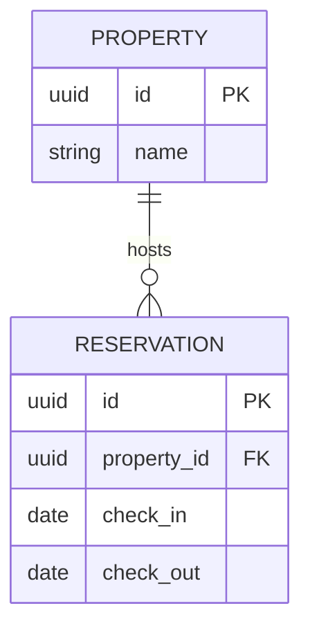

# Document Control
[Standard Document Control Table]

---

# 1. Architecture Overview
The platform will utilize a microservices architecture hosted on AWS.
```mermaid
C4Context
  title Centralized Hotel Platform
  Person(staff, "Hotel Staff")
  System(api, "API Gateway")
  System(res_service, "Reservation Service")
  System(prop_service, "Property Service")
  
  staff --> api
  api --> res_service
  api --> prop_service
```

# 2. Database Design (Multi-Tenant Strategy)
We will use a shared database, shared schema approach with a `property_id` column on every transactional table to enforce data isolation (Row-Level Security).

## 2.1 ERD (Reservation Module)


# 3. API Architecture
- All endpoints must require a JWT containing the user's authorized `property_id` list.

# 4. Architecture Decision Records (ADRs)
- **ADR-001:** Use PostgreSQL Row-Level Security (RLS) to enforce property data isolation at the database level, preventing accidental cross-property data leaks in application code.
