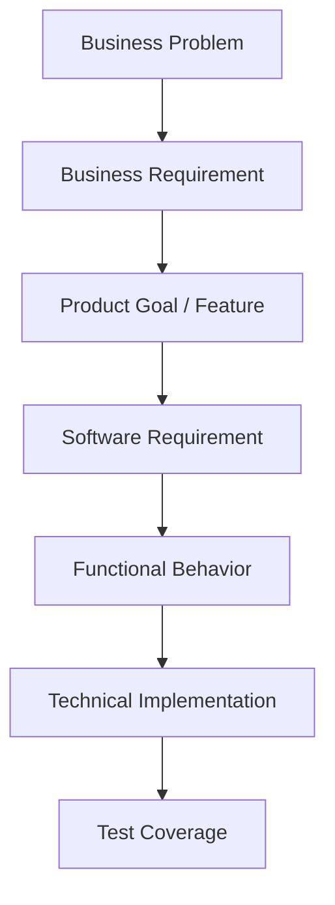

# Documentation Framework

The documentation lifecycle follows a strict sequence to ensure clear separation of concerns, moving from abstract business problems to concrete technical implementation.

## The Conceptual Flow

## Document Types

### 1. BRD (Business Requirements Document)
**Purpose:** Define *why* the business needs a solution.
**Answers:**
- What business problem exists?
- Why is the problem important?
- Who is affected?
- What business objective must be achieved?
- What is the business scope?
- What business outcome is expected?
**Does NOT contain:** Technical specs, API details, DB schemas, UI behavior.

### 2. PRD (Product Requirements Document)
**Purpose:** Define *what* product should be built.
**Answers:**
- Who are the target users?
- What product problem is being solved?
- What product capabilities are required?
- What features are included?
- What is the MVP vs future scope?
- How will product success be measured?
**Does NOT contain:** Technical design or detailed system architecture.

### 3. SRS-FRS (Software/Functional Requirements Specification)
**Purpose:** Define *what* the software must do.
**Contains:** Functional requirements, Non-functional requirements, business rules, user roles, use cases, workflows, data/integration requirements, acceptance criteria.

### 4. FSD (Functional Specification Document)
**Purpose:** Define *detailed functional behavior*.
**Contains:** Module behavior, screen behavior, field specs, validation rules, state transitions, detailed error handling, API functional behavior.

### 5. Technical Design
**Purpose:** Define *how* the system will be implemented technically.
**Contains:** System architecture, component architecture, technology stack, database design, API architecture, security, infrastructure, scalability.
