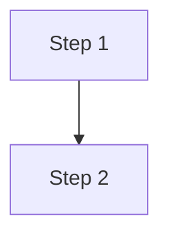

# Document Control
[Standard Document Control Table]

---

# 1. Introduction
[System purpose and scope of this document.]

# 2. User Roles & Permissions
| Role | Description | Key Permissions |
| :--- | :--- | :--- |
| Admin | [Desc] | [Perms] |

# 3. Functional Requirements
- **FR-001 [Name]:** The system shall...
  - **Traces to:** [FEAT-001]
  - **Acceptance Criteria:** [Criteria]

# 4. Non-Functional Requirements
- **NFR-001 [Performance]:** [Measurable metric]
- **NFR-002 [Security]:** [Measurable metric]

# 5. Business Rules
- **RULE-001:** [Rule description]

# 6. High-Level Workflows

# 7. Assumptions & Open Questions
- [ASSUMPTION] [State assumption]
- [OPEN QUESTION] [State question]
