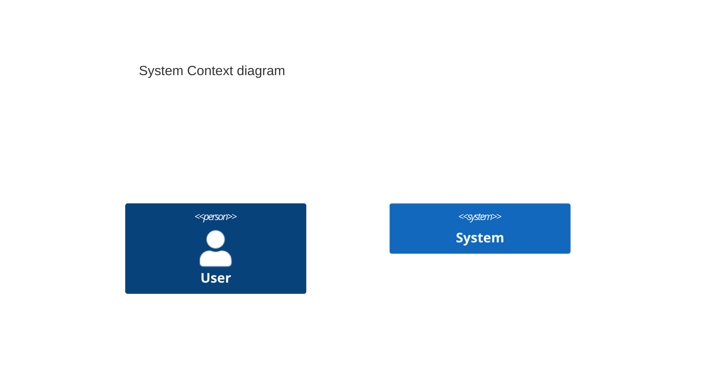
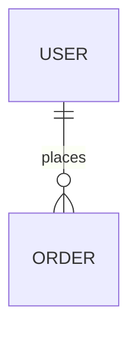

# Document Control
[Standard Document Control Table]

---

# 1. Architecture Overview
[High-level system architecture]

# 2. Technology Stack
- **Frontend:** [Stack]
- **Backend:** [Stack]
- **Database:** [Stack]

# 3. Component Architecture
[Detailed component design]

# 4. Database Design
## 4.1 ERD

## 4.2 Key Schemas
[Description of tables/collections]

# 5. API Architecture
- **Endpoint:** `POST /api/v1/resource`
- **Request:** [JSON]
- **Response:** [JSON]

# 6. Security Architecture
[Auth, Encryption in transit/at rest]

# 7. Infrastructure & Deployment
[AWS/Azure/GCP setup, CI/CD pipeline]

# 8. Architecture Decision Records (ADRs)
- **ADR-001:** [Decision and Rationale]

# 9. Technical Risks & Assumptions
- [RISK] [Description]
